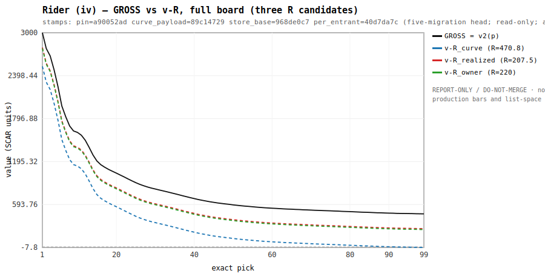
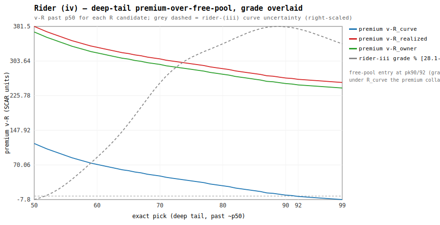

# Rider (iv) — THE VIEW: GROSS beside v-R  (REPORT-ONLY / DO-NOT-MERGE)

_stamps: pin=a90052ad curve_payload=89c14729 store_base=968de0c7 per_entrant=40d7da7c (five-migration head; read-only; asserted at load, HALT-on-mismatch)_

> **Axes note.** production bars and list-space R are orthogonal (R107.7); v2.11 bakes GROSS either way; making v-R the traded currency is the named post-v2.11 chapter, on the owner's word.

Per **exact** pick, smoothed (the v2 curve is the item-325 smoothed object; v-R is a labelled constant shift — **no decile bands**). Symmetric: three candidates, **no verdict**.

R scalars (pooled, from job 1): R_curve=**470.8**, R_realized=**207.5**, R_owner=**220**.

## Ratio table — p1/p60 and p1/p90 (how v-R re-shapes the ladder)

| currency | p1 | p60 | p90 | p1/p60 | p1/p90 |
|---|---:|---:|---:|---:|---:|
| GROSS | 3000 | 542 | 473 | 5.54 | 6.34 |
| v-R_curve (R=470.8) | 2529.2 | 71.2 | 2.2 | 35.52 | 1149.64 |
| v-R_realized (R=207.5) | 2792.5 | 334.5 | 265.5 | 8.35 | 10.52 |
| v-R_owner (R=220) | 2780 | 322 | 253 | 8.63 | 10.99 |

- GROSS compresses ~6x top-to-p90. Making **v-R** the traded currency **steepens** the ladder: under R_realized/R_owner the p1/p90 ratio roughly doubles (~10-11x). Under R_curve the deep-tail premium collapses toward 0 at the free-pool entry, so p1/p90 is **unstable** (denominator ~0) — a direct consequence of R_curve being the curve's own value at that pick. Findings, not a recommendation.

## Full board — GROSS vs v-R

| pick | GROSS | v-R_curve | v-R_realized | v-R_owner |
|---:|---:|---:|---:|---:|
| 1 | 3000 | 2529.2 | 2792.5 | 2780 |
| 10 | 1604 | 1133.2 | 1396.5 | 1384 |
| 20 | 1034 | 563.2 | 826.5 | 814 |
| 40 | 677 | 206.2 | 469.5 | 457 |
| 50 | 589 | 118.2 | 381.5 | 369 |
| 60 | 542 | 71.2 | 334.5 | 322 |
| 70 | 516 | 45.2 | 308.5 | 296 |
| 80 | 494 | 23.2 | 286.5 | 274 |
| 90 | 473 | 2.2 | 265.5 | 253 |
| 92 | 470 | -0.8 | 262.5 | 250 |
| 99 | 463 | -7.8 | 255.5 | 243 |

## Deep-tail premium-over-free-pool (v-R past ~p50) with rider-(iii) grade overlaid

| pick | GROSS | v-R_curve | v-R_realized | v-R_owner | rider-iii grade % |
|---:|---:|---:|---:|---:|---:|
| 50 | 589 | 118.2 | 381.5 | 369 | 28.1 |
| 60 | 542 | 71.2 | 334.5 | 322 | 30.9 |
| 70 | 516 | 45.2 | 308.5 | 296 | 36.0 |
| 80 | 494 | 23.2 | 286.5 | 274 | 38.6 |
| 90 | 473 | 2.2 | 265.5 | 253 | 39.8 |
| 92 | 470 | -0.8 | 262.5 | 250 | 39.6 |
| 95 | 467 | -3.8 | 259.5 | 247 | 39.3 |
| 99 | 463 | -7.8 | 255.5 | 243 | 38.6 |

- The premium region past ~p50 carries a rider-(iii) uncertainty grade rising to ~40.0% at the free-pool entry (~2.16x the 17.35% top): **whichever R the owner reads, the deep-tail premium is a low-confidence number.**
- Under **R_realized (207.5)** and **R_owner (220)** the premium at pk90 is ~266 / ~253 SCAR — a real gap of a top pick over the free pool. Under **R_curve (470.8)** it is ~2 (collapses to ~0 by construction).
